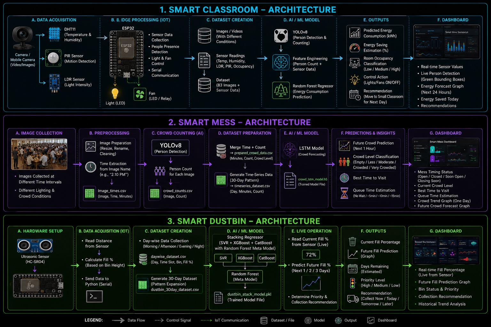

# CampusEye – AI-Based Smart Campus Monitoring & Management System

> An AIoT-based Smart Campus solution integrating **Computer Vision, Machine Learning, Deep Learning, IoT, and Streamlit** for intelligent campus resource management.
---

##  Overview

CampusEye is an AI-powered Smart Campus Monitoring & Management System developed during the **Summer Internship on Smart Energy Systems: Integrating Digital Technologies, IoT and AI/ML** conducted at **National Institute of Technology Warangal** in association with **Hitachi Energy**.

The system consists of three intelligent modules:

- Smart Classroom
- Smart Mess
- Smart Dustbin

All modules are integrated into a single interactive **Streamlit Dashboard**.

---

# Features

## Smart Classroom

- Real-time classroom occupancy detection using YOLOv8
- Automatic light and fan control using ESP32
- Temperature, humidity and ambient light monitoring
- Future energy prediction using Random Forest Regressor
- Classroom utilization recommendation
- Interactive Streamlit dashboard

---

## Smart Mess

- Student crowd detection using YOLOv8
- Time-series dataset generation
- Future crowd prediction using LSTM
- Queue waiting time estimation
- Best time recommendation
- Mess opening and closing alerts

---

## Smart Dustbin

- Live dustbin fill monitoring using HC-SR04 Ultrasonic Sensor
- ESP32-based IoT integration
- Feature Engineering (Previous Fill & Fill Rate)
- Future fill prediction using Stacking Regressor
- Collection priority recommendation
- Days remaining estimation

---

# System Architecture

<p align="center"></p>

---

# Hardware Design
<p align="center">  </p>

---

# Hardware Prototype
<p align="center">  </p>

▶ **Watch Demo**

[🎥 Streamlit Dashboard Demo](images_readme/streamlit%20demo.mp4)


# AI Models Used

| Module | AI Model |
|---------|----------|
| Smart Classroom | YOLOv8 + Random Forest Regressor |
| Smart Mess | YOLOv8 + LSTM |
| Smart Dustbin | Stacking Regressor (SVR + XGBoost + CatBoost + Random Forest as meta model) |

---

# Tech Stack

- Python
- Streamlit
- YOLOv8
- TensorFlow / Keras
- Scikit-learn
- XGBoost
- CatBoost
- OpenCV
- ESP32
- Arduino IDE
- Pandas
- NumPy

---

# Project Structure

```
Smart-Campus-Monitoring-System
│
├── smart_classroom
│
├── mess_project
│
├── smart_dustbin
│
├── images
│
├── app.py
│
├── requirements.txt
│
└── README.md
```

---

# How to Run

```bash
git clone https://github.com/kallamjashwanth/CampusEye

cd Smart-Campus-Monitoring-System

pip install -r requirements.txt

streamlit run app.py
```

---

# Results

- AI-based real-time classroom monitoring
- Future energy consumption prediction
- Crowd forecasting using LSTM
- Intelligent waste collection recommendation
- Unified Streamlit dashboard
- **Secured 3rd Place among 22 teams** during the NIT Warangal Summer Internship Project Competition

---

# Developed By

**Kallam Jashwanth**

Summer Internship (AI/ML & IoT)

National Institute of Technology Warangal

Indian Institute of Technology Bhubaneswar

---

# If you like this project
Please ⭐ the repository.
